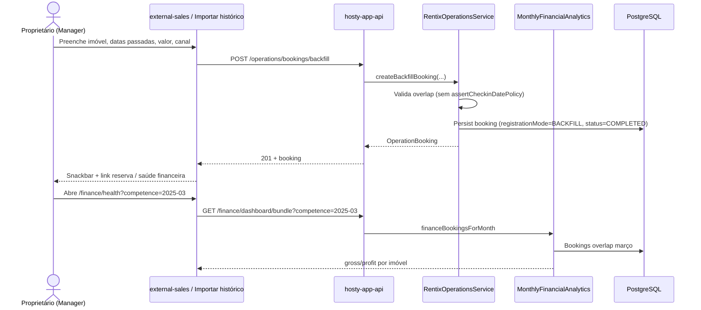
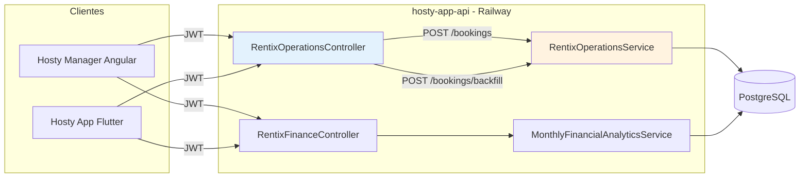

# Aluguéis históricos e vendas externas — Hosty Manager CRM

> Documento de produto e arquitetura · Jun/2026  
> Escopo: registrar aluguéis/receitas anteriores que **não** passaram pelo app Hosty, com controle financeiro no CRM web.

---

## 1. Contexto e problema

### O que o usuário precisa

Proprietários que migram para o Hosty (ou passam a usar o Manager como CRM) já têm meses ou anos de locações via Airbnb, Booking, WhatsApp, PIX direto etc. Essas estadias:

- Não existem no banco do Hosty;
- Distorcem ocupação, receita por canal e saúde financeira;
- Impedem visão confiável de margem, reserva operacional e “quanto posso retirar”.

O pedido é **controle para cadastrar valores/aluguéis passados** — não apenas bloquear calendário, mas alimentar o financeiro com bruto, taxa de plataforma e competência correta.

### O que existe hoje

| Capacidade | Onde | Situação |
|------------|------|----------|
| Vendas externas (form por canal) | Manager `external-sales.page.ts` → `POST /operations/bookings` | UI pronta; **API rejeita check-in no passado** |
| Criar reserva manual | Flutter `create_booking_page.dart` → mesma API | Mesma restrição + validação client-side de antecedência mínima |
| Import iCal | API `syncPropertyIcalFeed` | Cria bloqueios (`ICAL_IMPORT`, `grossAmount=0`); não importa passado de forma financeira |
| Convidados retroativos | API `/operations/retroactive-guests` (+ CSV) | Convite de hóspede para cadastro futuro; **não cria reserva nem valor** |
| Dashboard financeiro | `GET /finance/dashboard/bundle?competence=` | Funciona se a reserva existir e sobrepor o mês |
| Saúde financeira por imóvel | Manager `financial-health.page.ts` | Agrega bundle + custos fixos; depende de reservas cadastradas |

### Lacuna central (bloqueador)

A API aplica `assertCheckinDatePolicy` em **toda** criação via `createBooking`:

```2145:2159:hosty-app-api/src/main/java/com/hosty/api/application/usecase/RentixOperationsService.java
    private void assertCheckinDatePolicy(String propertyId, LocalDate checkin) {
        LocalDate today = LocalDate.now();
        if (checkin.isBefore(today)) {
            throw new ResponseStatusException(HttpStatus.BAD_REQUEST, "A data de check-in nao pode ser no passado.");
        }
        int minDays = tenantCancellationMinDays(propertyId);
        long daysUntilCheckin = ChronoUnit.DAYS.between(today, checkin);
        if (daysUntilCheckin < minDays) {
            throw new ResponseStatusException(
                    HttpStatus.BAD_REQUEST,
                    "Este imovel exige reservar com pelo menos "
                            + minDays
                            + " dia(s) de antecedencia em relacao ao check-in."
            );
        }
    }
```

O Manager em `/sales` (`external-sales.page.ts`) envia datas livres no `<input type="date">` e chama o mesmo endpoint — **o formulário sugere que histórico funciona, mas a API impede**.

Outros gaps:

- Campo `notes` do formulário de vendas **não é enviado** à API.
- Sem flag `isHistorical` / `backfill` no modelo de reserva.
- Sem importação em lote de reservas+valores (só CSV de convidados retroativos).
- Reservas sem `tenantIdentifier` ficam `OPEN` — fluxo operacional (check-in/out) irrelevante para histórico, mas ainda aparecem em filas se mal configuradas.
- iCal cria reservas com `grossAmount=0` — útil para calendário, inútil para reconciliação financeira retroativa.

### Resumo do problema

> O Hosty já tem **80% da modelagem** (reserva + `reservationSource` + `grossAmount` + `competence` + fees), mas **zero caminho válido** para persistir estadias já encerradas. O CRM web expõe a intenção (`/sales`) sem o contrato de API correspondente.

---

## 2. Benchmark de mercado

Comparação focada em backfill, vendas externas, financeiro e fronteira CRM/PMS.

| Ferramenta | Importação histórica / backfill | Vendas externas (OTA + direto) | Reconciliação financeira | CRM vs PMS |
|------------|--------------------------------|-------------------------------|--------------------------|------------|
| **Guesty** | Importação de passado **depende do canal**; Airbnb importa histórico (sem e-mail/telefone); muitos canais exigem suporte manual; migração gerenciada inclui histórico | Channel manager 60+ canais; inbox unificado; reservas manuais complementam gaps de API | Pagamentos e accounting nativos; owner statements; fees por canal no mesmo DB | PMS completo; “CRM” = inbox + automação + owner portal — tudo no mesmo produto |
| **Hostaway** | **Não importa** check-ins passados; reservas pré-integração devem ser recriadas como diretas ou mantidas no OTA; Airbnb ~30 dias lookback | Integrações por canal; reserva manual para preencher buracos | Relatórios + integrações contábeis de terceiros; financeiro de reservas importadas pode ser incompleto (GDPR/proxy) | PMS com CRM via inbox/tasks; cada add-on = outro login |
| **Lodgify** | Na conexão de canal, importa dados de hóspedes/reservas passadas (escopo limitado ao que o canal expõe) | Site direto + channel manager (~10 OTAs no tier menor) | Pagamentos Lodgify; gestão de reservas no mesmo painel | PMS leve; menos separação CRM/backoffice — dono opera tudo no mesmo lugar |
| **Stays.net** | Airbnb: atual + futuro + **até 1 ano de histórico**; Booking: futuras na conexão; volume grande de diretas → planilha para `sac@stays.com.br` | Channel manager forte no Brasil/LATAM; reserva manual obrigatória antes de conectar canais sem import | Relatórios, gestão financeira, usuários por papel (owner, limpeza, etc.) | PMS operacional; CRM = dashboards + permissões — não produto separado |
| **Hospitable** | API de canais: só futuro/em curso; **manual booking aceita datas passadas** explicitamente para “importar ou rastrear reservas passadas” | Manual vs Direct bem documentados; iCal não traz passado | Financeiros editáveis a qualquer momento em manual bookings | PMS; manual booking é o padrão de mercado para backfill quando API não entrega |

### Padrões observados

1. **Backfill quase nunca é 100% automático** — ou é manual booking, ou planilha + suporte, ou import parcial por canal.
2. **Reserva manual com financeiro editável** é o MVP universal (Hospitable, Hostaway workaround, Stays pré-conexão).
3. **CRM e PMS compartilham o mesmo núcleo de reserva** nos players maduros; separar serviço só faz sentido em escala enterprise ou times distintos.
4. **iCal ≠ backfill financeiro** — bloqueia datas, não reconcilia receita.

---

## 3. Oportunidades para Hosty Manager

Priorizadas para retroactive/historical + controle financeiro.

### MVP (4–6 semanas, 1 dev)

| # | Feature | Valor | Esforço |
|---|---------|-------|---------|
| 1 | **Endpoint de backfill histórico** (`POST .../bookings/backfill`) — datas passadas, status `COMPLETED`, pula antecedência e fluxo inquilino | Desbloqueia o caso de uso real | Médio (API + testes) |
| 2 | **Wizard “Importar histórico” no Manager** — extensão de `/sales` ou rota `/sales/import` com competência editável, taxa % custom, modo “sem hóspede” | UX clara vs reserva operacional | Médio (Angular) |
| 3 | **Indicador de origem no financeiro** — badge `BACKFILL` / `EXTERNAL` em saúde financeira e lista de reservas | Confiança nos números | Baixo |

### v1.1

| # | Feature | Valor |
|---|---------|-------|
| 4 | **Import CSV em lote** (propertyId, checkin, checkout, gross, channel, fee%, competence) com relatório de erros/duplicatas | Onboarding de carteira inteira |
| 5 | **Reconciliação iCal → financeiro** — converter bloqueio `ICAL_IMPORT` em venda externa com valor | Fecha gap de quem já usa iCal |
| 6 | **Competência desacoplada do check-in** — campo explícito no backfill (receita reconhecida em outro mês) | IR/contabilidade informal do owner |

### v2

| # | Feature | Valor |
|---|---------|-------|
| 7 | **Painel “cobertura histórica”** — % meses com receita cadastrada vs ocupação estimada | Gamifica migração de dados |
| 8 | **Vincular convidado retroativo à reserva backfill** — unificar `/retroactive-guests` + booking | Jornada inquilino pós-migração |
| 9 | **Export reconciliação** — CSV competência × canal × imóvel com flag backfill | Contador/planilha externa |

---

## 4. O que já existe no Hosty (inventário honesto)

### API (`hosty-app-api`)

| Endpoint | Uso para histórico | Limitação |
|----------|-------------------|-----------|
| `POST /api/v1/operations/bookings` | Vendas externas / manual | ❌ Check-in passado; antecedência mínima |
| `GET /api/v1/operations/bookings` | Listar incluindo externas | ✅ Filtro por `reservationSource` no client |
| `POST /api/v1/operations/retroactive-guests` | Convite hóspede | ⚠️ Não cria booking nem valor |
| `POST /api/v1/operations/retroactive-guests/import-csv` | Lote de convites | ⚠️ Mesmo escopo |
| `POST /api/v1/properties/{id}/ical-feeds` + `sync` | Bloqueio calendário | ⚠️ `grossAmount=0`, sem passado financeiro |
| `GET /api/v1/finance/dashboard/bundle?competence=yyyy-MM` | KPIs mensais | ✅ Inclui reservas que sobrepõem o mês |
| `GET /api/v1/finance/export/csv?from=&to=` | Export | ✅ Se dados existirem |
| `POST /api/v1/finance/bookings/{id}/variable-costs` | Custos por estadia | ✅ Aplicável a backfill |

### Campos de domínio relevantes

**`ReservationSource`** (`ReservationSource.java`):

`HOSTY`, `AIRBNB`, `BOOKING`, `DIRECT`, `WHATSAPP`, `INSTAGRAM`, `MANUAL`, `ICAL_IMPORT`, `OTHER`

**`CreateBookingRequest`** (`RentixOperationsController.java`):

- `propertyId`, `competence` (yyyy-MM), `grossAmount`
- `platform` + `feeType` + `percentage` / `fixedAmount`
- `checkinDate`, `checkoutDate`, `tenantIdentifier` (opcional)
- `reservationSource`

**Financeiro:** competência na reserva + overlap de datas (`operationBookingOverlapsMonth`) determina em qual mês a receita aparece no bundle.

**Persistência:** `OperationBookingEntity` já tem `reservationSource`, `icalFeedId`, `icalUid` (V migrations).

### Flutter (`hosty-frontend`)

| Tela | Suporte histórico |
|------|-------------------|
| `create_booking_page.dart` | ❌ `validateStayPeriod` + antecedência mínima |
| `external_sales` | ❌ Não existe no app mobile |
| `retroactive_guests_page.dart` | ⚠️ Só convites; UI básica em `operations_page.dart` |
| `finance_dashboard_page.dart` | ✅ Exibe o que a API tem |
| iCal no hub | ✅ Sync; sem valor |

### Hosty Manager (`hosty-manager`)

| Tela | Suporte histórico |
|------|-------------------|
| `/sales` — `external-sales.page.ts` | ⚠️ UI completa; API bloqueia passado; `notes` não persistido |
| `/reservations` — `reservations.page.ts` | Mesmo `createBooking`; sem `reservationSource` no form |
| `/finance` + `/finance/health` | ✅ Leitura; depende de dados cadastrados |
| `operations.service.ts` | Cliente fino — sem agregação BFF além de chamadas paralelas em health |

### Mapa de paridade (docs/SCREENS.md)

`external_sales_page.dart` (CRM) ↔ `/sales` — **paridade de rota**, não de capacidade histórica.

---

## 5. Arquitetura: BFF vs estender API

### Preocupação do usuário

> “Preciso de um BFF para não misturar mudanças do CRM com a API do app mobile?”

### Opções

#### Opção A — Estender `hosty-app-api` com endpoints namespaced

Ex.: `POST /api/v1/operations/bookings/backfill` ou prefixo `/api/v1/manager/bookings/backfill`.

| Prós | Contras |
|------|---------|
| Um deploy (Railway), um domínio, uma transação DB | Mesmo repositório Java — exige disciplina de PR |
| Reutiliza `RentixOperationsService`, finance, auth JWT | Risco de regressão mobile se alterar `createBooking` compartilhado |
| Manager e Flutter continuam clientes HTTP simples | |
| Validações diferentes ficam em métodos separados (`createBackfillBooking`) | |

#### Opção B — Novo serviço BFF (Node/Spring)

| Prós | Contras |
|------|---------|
| Contrato CRM isolado | +1 deploy, +1 pipeline, +1 ponto de falha |
| Poderia agregar bundle+bookings+properties | Duplicação de DTOs e regras de negócio |
| | Latência extra; auth/token refresh duplicado |
| | Time pequeno: custo de manutenção > benefício hoje |

#### Opção C — BFF-lite no Angular (`OperationsService`)

Agregação apenas no front (já feito em `financial-health.page.ts`).

| Prós | Contras |
|------|---------|
| Zero infra nova | **Não resolve** validação de datas na API |
| Bom para dashboards compostos | Lógica de backfill não pode ficar só no client |

### Framework de decisão (escala Hosty hoje)

| Critério | Peso | A | B | C |
|----------|------|---|---|---|
| Time único, domínio compartilhado | Alto | ✅ | ❌ | parcial |
| Deploy único Railway | Alto | ✅ | ❌ | ✅ |
| Isolamento contrato CRM | Médio | ✅ com namespace | ✅✅ | ❌ |
| Necessidade de agregação complexa | Baixo hoje | ✅ | ✅ | ✅ |
| Custo operacional | Alto | ✅ | ❌ | ✅ |

### Recomendação: **BFF completo — NÃO**

**Estender a API (Opção A)** com endpoints e métodos de serviço dedicados ao backfill, **sem alterar** o comportamento de `POST /operations/bookings` usado pelo Flutter.

**Usar BFF-lite (Opção C)** apenas para telas analíticas do Manager (saúde financeira, dashboards), como já é feito.

#### Rationale

1. O problema não é “formato de resposta do CRM” — é **regra de negócio** (datas passadas, status concluído) que precisa viver no servidor.
2. Um BFF sem dono da verdade viraria proxy que ainda chama a mesma API — ou reimplementaria regras (pior).
3. Namespace `/operations/bookings/backfill` ou `/manager/...` + `@PreAuthorize('OWNER')` + testes de contrato isolam o CRM sem segundo serviço.
4. O app mobile **não chama** o endpoint de backfill; contrato estável para `createBooking` permanece.
5. Quando o time crescer ou houver tenant B2B com integrações, um BFF pode ser reavaliado — não é prematura otimização **hoje**.

#### Regras de isolamento (checklist de PR)

- [ ] Novos endpoints em controller separado ou seção claramente marcada `// manager-only`
- [ ] Novo método `createBackfillBooking` — **não** relaxar `assertCheckinDatePolicy` no fluxo padrão
- [ ] Testes: `createBooking` passado continua 400; `backfill` passado retorna 201
- [ ] OpenAPI / `docs/API_MAPPING.md` documentam escopo Manager vs Mobile

---

## 6. Proposta de solução (MVP)

### User stories

1. **Como proprietário**, quero registrar uma estadia de março/2025 feita no Airbnb com valor bruto e taxa de 15%, para ver minha receita real na saúde financeira.
2. **Como proprietário**, quero cadastrar várias locações passadas sem e-mail do hóspede, para não disparar convites nem filas operacionais.
3. **Como proprietário**, quero escolher a competência financeira (mês de reconhecimento), quando diferente do mês do check-in.
4. **Como proprietário**, quero ver na lista de vendas quais registros são backfill vs operacionais.

### Modelo de dados (campos novos sugeridos)

| Campo | Tipo | Obrigatório | Notas |
|-------|------|-------------|-------|
| `registrationMode` | enum | sim no backfill | `OPERATIONAL` (default) \| `BACKFILL` |
| `propertyId` | UUID | sim | existente |
| `checkinDate` / `checkoutDate` | date | sim | checkout > checkin; passado permitido no backfill |
| `grossAmount` | decimal | sim | > 0 |
| `competence` | yyyy-MM | sim | pode divergir do check-in |
| `reservationSource` | enum | sim | AIRBNB, BOOKING, WHATSAPP, etc. |
| `platform` + fee policy | | sim | reutilizar `PlatformFeePolicy` |
| `tenantIdentifier` | string | não | se vazio: sem convite, status terminal |
| `externalReference` | string | não | código Airbnb/Booking para dedupe |
| `notes` | string | não | observações do owner |
| `skipOperationalFlow` | bool | default true no backfill | sem checklist/check-in |

Status inicial sugerido: `COMPLETED` (ou `CONFIRMED` + `checkedOutAt` sintético) para não poluir inbox.

### Contrato API (sketch)

#### `POST /api/v1/operations/bookings/backfill`

**Auth:** `OWNER` ou `ADMIN` (dono do imóvel)

**Request:**

```json
{
  "propertyId": "uuid",
  "checkinDate": "2025-03-10",
  "checkoutDate": "2025-03-15",
  "competence": "2025-03",
  "grossAmount": 2500.00,
  "reservationSource": "AIRBNB",
  "platform": "AIRBNB",
  "feeType": "PERCENTAGE",
  "percentage": 15,
  "tenantIdentifier": null,
  "externalReference": "HMABC123",
  "notes": "Importado da planilha Airbnb 2025"
}
```

**Response 201:**

```json
{
  "booking": { "id": "uuid", "registrationMode": "BACKFILL", "lifecycleStatus": "COMPLETED", "...": "..." },
  "pendingTenantInviteCreated": false
}
```

**Erros:** 400 overlap de datas, 403 não-dono, 409 `externalReference` duplicado (opcional v1.1).

#### `POST /api/v1/operations/bookings/backfill/import-csv` (v1.1)

Body: `{ "csv": "propertyId;checkin;checkout;gross;source;feePct;competence;ref;notes\\n..." }`  
Response: `{ "created": [...], "errors": ["Linha 3: overlap"], "importedAt": "..." }`

#### `GET /api/v1/operations/bookings?registrationMode=BACKFILL` (v1.1)

Filtro opcional na listagem existente.

### UI no Manager

**Recomendação:** evoluir `/sales` em duas abas:

1. **Venda futura / em curso** — formulário atual (`external-sales.page.ts`), check-in ≥ hoje.
2. **Importar histórico** — wizard 3 passos:
   - Passo 1: imóvel + canal + referência externa
   - Passo 2: datas + valor + taxa + competência
   - Passo 3: hóspede opcional + notas + confirmação (“não dispara check-in”)

Links cruzados: `/finance/health?competence=`, `/reservations?filter=backfill`.

Arquivos a tocar:

- `src/app/features/sales/external-sales.page.ts` (+ html/scss)
- `src/app/core/api/operations.service.ts` — `createBackfillBooking()`
- `src/app/core/models/operations.models.ts` — tipos
- `docs/API_MAPPING.md`

### Diagramas

#### Sequência — registrar aluguel histórico



#### Componentes — CRM ↔ API



---

## 7. Riscos e decisões abertas

| Risco / decisão | Impacto | Mitigação proposta |
|-----------------|---------|-------------------|
| **Duplicata** (mesmo período Airbnb + backfill manual) | Calendário e receita duplicados | Checagem overlap existente; opcional `externalReference` unique por property |
| **Competência vs check-in** | Receita no mês “errado” para o owner | Campo explícito no wizard; default = mês do check-in (como `external-sales.page.ts` hoje) |
| **Taxa de plataforma histórica** | Margem incorreta se % errada | Permitir edição posterior de fee; presets por canal (já em `CHANNELS` no Manager) |
| **Hóspede opcional** | Convite indesejado ou fila `PENDING_TENANT_ACCEPTANCE` | Backfill default sem `tenantIdentifier`; convite só se checkbox explícito |
| **Reservas iCal com valor zero** | Buracos no financeiro | v1.1: ação “Completar financeiro” em reserva `ICAL_IMPORT` |
| **Alterar `createBooking` compartilhado** | Regressão no Flutter | Endpoint separado; testes de contrato |
| **Antecedência mínima no Manager futuro** | Confusão entre abas | Validação client-side distinta por aba |
| **Co-proprietário no CRM** | Quem pode backfill? | Mesma regra OWNER da API hoje |
| **Auditoria / LGPD** | Dados de hóspedes importados sem consentimento | Backfill sem PII por default; nota no wizard |
| **BFF no futuro** | Integrações B2B, webhooks | Reavaliar quando >2 clientes com contratos distintos ou time >3 devs backend |

### Decisões abertas para o produto

1. Backfill deve **bloquear calendário** em datas passadas? (Recomendação: sim, para ocupação histórica correta, mas status `COMPLETED` sem ações pendentes.)
2. Permitir backfill em datas **futuras** com flag backfill? (Recomendação: não no MVP — usar `/sales` normal.)
3. Unificar `/retroactive-guests` com backfill em um único wizard? (Recomendação: v2.)
4. Admin Hosty pode importar em massa para onboarding de cliente? (Recomendação: v1.1 com role `ADMIN`.)

---

## Referências no repositório

| Artefato | Caminho |
|----------|---------|
| Vendas externas (Manager) | `hosty-manager/src/app/features/sales/external-sales.page.ts` |
| Cliente API operations | `hosty-manager/src/app/core/api/operations.service.ts` |
| Saúde financeira | `hosty-manager/src/app/core/finance/financial-health.ts` |
| Controller reservas | `hosty-app-api/.../RentixOperationsController.java` |
| Criação + política de datas | `hosty-app-api/.../RentixOperationsService.java` |
| Fontes de reserva | `hosty-app-api/.../ReservationSource.java` |
| Criar reserva (Flutter) | `hosty-frontend/lib/.../create_booking_page.dart` |
| Convidados retroativos | `hosty-frontend/lib/.../retroactive_guests_page.dart` |
| Mapeamento API Manager | `hosty-manager/docs/API_MAPPING.md` |
| Paridade telas | `hosty-manager/docs/SCREENS.md` |

---

*Documento gerado para apoiar decisão de produto e arquitetura. Não implica implementação imediata.*
